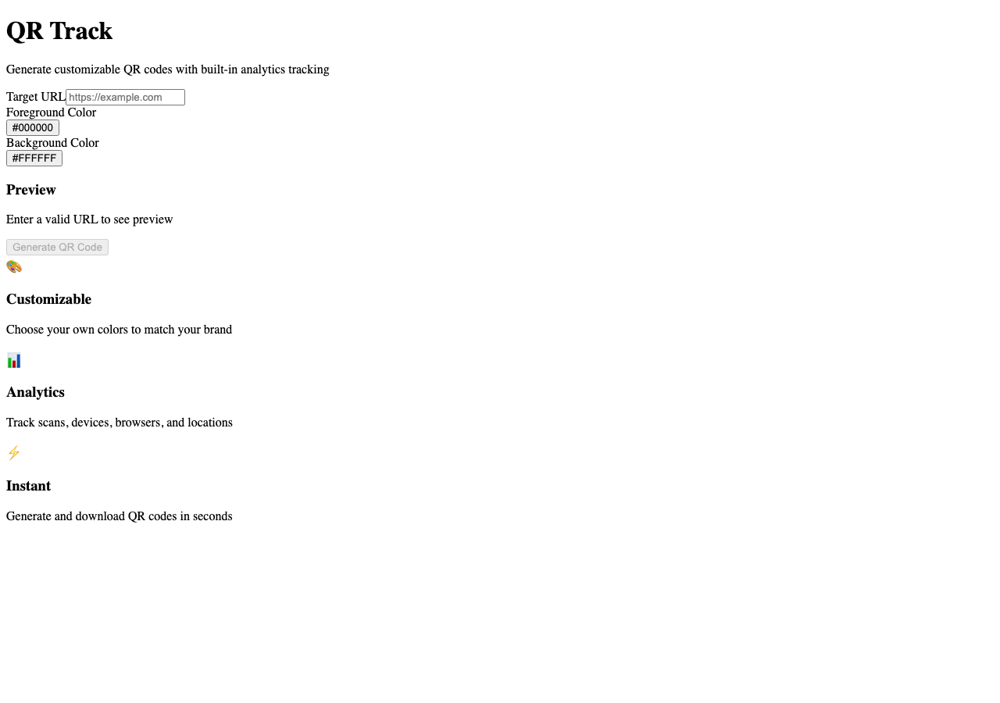
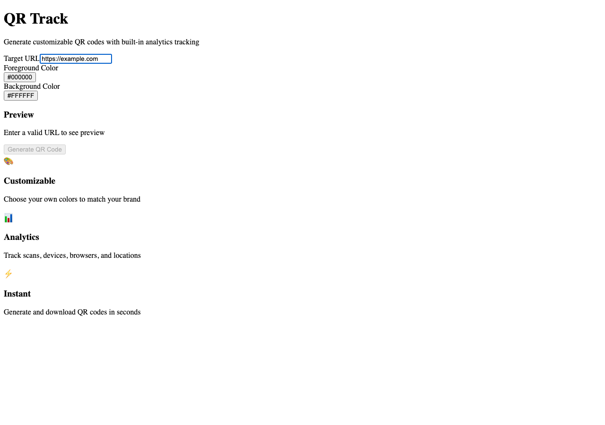

# URL Shortening & Redirect System - Test Coverage

**ADW ID:** 07707eb7
**Date:** 2026-02-13
**Specification:** specs/issue-3-adw-07707eb7-sdlc_planner-url-shortening-redirect-system.md

## Overview

This feature adds comprehensive test coverage for the existing URL shortening and redirect system. The core functionality (short URL generation, redirect handling, and scan tracking) was previously implemented in Issue #2. This work focuses on ensuring reliability through unit tests for the redirect route and E2E tests validating the complete user flow.

## Screenshots

### QR Generator Homepage


The homepage shows the QR code generator interface where users can enter a target URL to generate a short URL.

### URL Entered with Preview


After entering a valid URL, the system generates a QR code with an associated short URL in the format `/r/[shortCode]`.

### 404 Error - Invalid Short Code


When accessing a non-existent short code, the system returns a 404 error indicating the QR code was not found.

## What Was Built

This implementation added comprehensive test coverage for the redirect system:

- **Unit tests** for the redirect route handler (`/r/[shortCode]`)
- **E2E test specification** for the complete redirect flow
- **Test coverage** for scan tracking, user agent parsing, geolocation extraction, and error handling

## Technical Implementation

### Files Modified

- `.claude/commands/e2e/test_redirect_flow.md`: New E2E test specification for validating the redirect flow from QR generation to successful redirect with scan tracking.
- `src/app/r/[shortCode]/__tests__/route.test.ts`: New comprehensive unit test suite (629 lines) covering all aspects of the redirect route handler.

### Key Changes

- **Comprehensive Unit Test Suite**: Added 30+ test cases covering successful redirects, 404 handling, scan event tracking, user agent parsing (mobile/desktop/tablet), geolocation extraction, IP address handling with privacy truncation, and database error scenarios.

- **Database Operations Testing**: Tests verify QR code lookups by short code, scan event creation with various parameter combinations, and graceful handling of database failures.

- **User Agent Parsing Tests**: Validates device type detection (mobile/tablet/desktop) and browser identification across various user agent strings (iPhone, Android, iPad, Chrome, Safari, Firefox, Edge).

- **Geolocation & Privacy Tests**: Tests extraction of country/city from Vercel Edge headers and IP address truncation (last octet replaced with `xxx`) for privacy compliance.

- **E2E Test Specification**: Created detailed test steps for validating the complete flow: generate QR code → extract short URL → navigate to short URL → verify redirect → confirm scan tracking.

## How to Use

### Running Unit Tests

Execute the test suite to verify redirect route functionality:

```bash
pnpm test
```

To run only the redirect route tests:

```bash
pnpm test src/app/r/\[shortCode\]/__tests__/route.test.ts
```

### Running E2E Tests

Follow the E2E test specification to manually validate the redirect flow:

1. Read `.claude/commands/test_e2e.md` for E2E testing instructions
2. Execute the test steps in `.claude/commands/e2e/test_redirect_flow.md`
3. Verify all success criteria are met

### Test Coverage Areas

The tests cover these key scenarios:

1. **Successful Redirect**: Valid short code redirects to target URL with 302 status
2. **404 Handling**: Invalid short codes return proper error response
3. **Scan Tracking**: Scan events are created with correct metadata
4. **Device Detection**: User agents are parsed to identify device type and browser
5. **Geolocation**: Country and city are extracted from request headers
6. **Privacy**: IP addresses are truncated before storage
7. **Error Handling**: Database errors result in 500 status responses

## Configuration

No additional configuration is required. The tests use Jest and follow the existing test patterns established in the codebase.

### Test Environment

- **Test Framework**: Jest with TypeScript support
- **Mocking**: Database and utility functions are mocked using `jest.mock()`
- **Test Pattern**: Follows the approach from `src/app/api/qr/generate/__tests__/route.test.ts`

## Testing

### Unit Test Structure

The test file is organized into logical sections:

```
GET /r/[shortCode] - Database Operations
├─ QR Code Lookup
├─ Scan Event Creation
GET /r/[shortCode] - User Agent Parsing
├─ Mobile User Agents
├─ Desktop User Agents
├─ Tablet User Agents
├─ Edge Cases (empty user agent, unknown agents)
GET /r/[shortCode] - Geolocation Extraction
├─ With Vercel Headers
├─ Without Headers
GET /r/[shortCode] - IP Address Handling
├─ IPv4 Truncation
├─ IPv6 Handling
├─ Various Header Formats
GET /r/[shortCode] - Integration Scenarios
├─ Complete Redirect Flow
├─ Error Handling
```

### Validation Commands

Run these commands to ensure all tests pass and no regressions occur:

```bash
pnpm test              # Run all unit tests
pnpm type-check        # Verify TypeScript types
pnpm build             # Verify production build
pnpm lint              # Check code style
```

## Notes

- **Non-Blocking Scan Tracking**: The redirect happens immediately while scan creation runs in the background. Scan tracking failures are logged but do not block the redirect.

- **Privacy Compliance**: IP addresses are automatically truncated (last octet replaced with `xxx`) before storage to protect user privacy.

- **Geolocation Source**: Country and city information is extracted from Vercel Edge headers (`x-vercel-ip-country`, `x-vercel-ip-city`), which are automatically added by Vercel's edge network.

- **Test Mocking Strategy**: Tests mock database and utility functions to isolate the route handler logic and avoid requiring polyfills for NextRequest in the test environment.

- **Core Functionality**: The redirect route handler at `src/app/r/[shortCode]/route.ts:14-65` was implemented in a previous feature. This work focuses solely on ensuring reliability through comprehensive test coverage.
