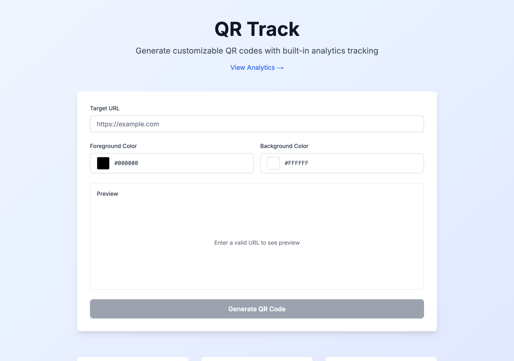
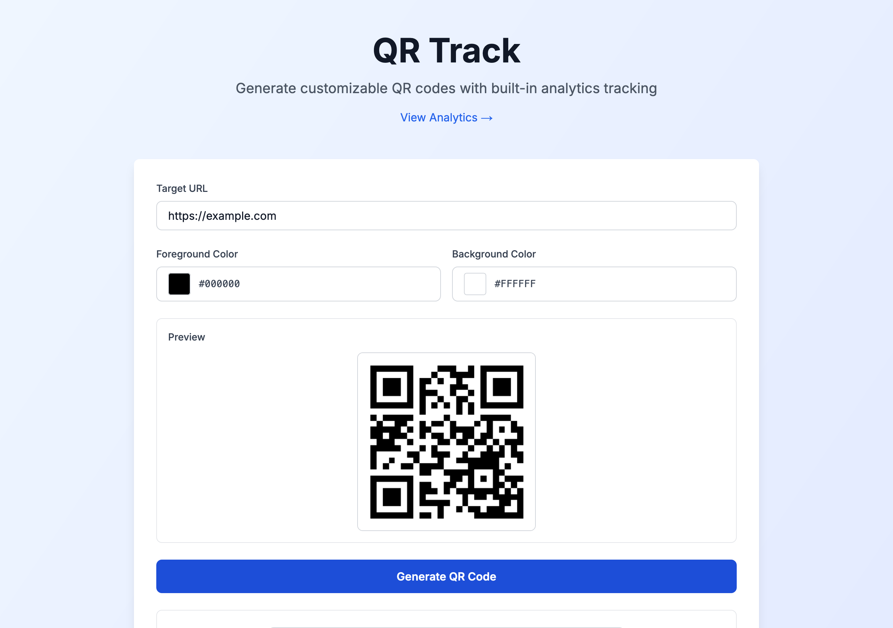
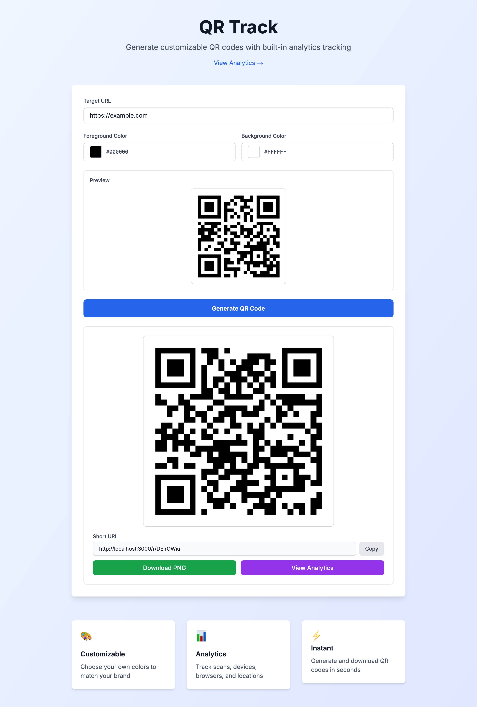
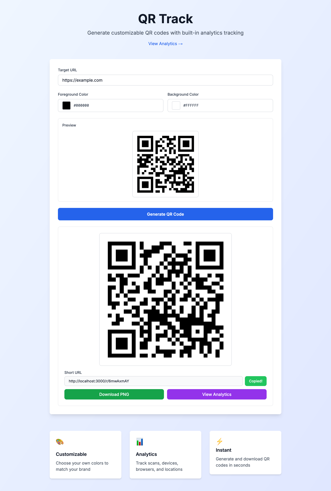

# UI Text Contrast Accessibility Fix

**ADW ID:** 10abd5de
**Date:** 2026-02-13
**Specification:** specs/issue-12-adw-10abd5de-sdlc_planner-fix-low-contrast-text.md

## Overview

Fixed critical accessibility issues in the QR generator UI where multiple text elements had insufficient color contrast, making them difficult or impossible to read. Added explicit Tailwind CSS text color classes to ensure WCAG AA compliance (4.5:1 minimum contrast ratio) for all interactive elements including input placeholders, color code labels, generated URLs, and buttons.

## Screenshots

### Initial State - Before Fix


The screenshot shows the QR generator form with barely visible placeholder text and color code labels.

### Generated QR Code Result


After generating a QR code, the short URL is now clearly readable.

### Copy Button Visibility


The Copy button text is now visible with proper text contrast.

### Copy Button Active State


The "Copied!" state maintains proper contrast with green background and white text.

## What Was Built

This fix addressed accessibility violations across the QR generator interface:

- Enhanced input placeholder text visibility with explicit color classes
- Improved readability of hex color code labels (#000000, #FFFFFF)
- Made generated short URL text clearly visible
- Fixed Copy button text contrast for better usability
- Created E2E test to validate text contrast improvements

## Technical Implementation

### Files Modified

- `src/components/qr-generator/QRGenerator.tsx`: Updated CSS classes for five UI elements to add explicit light-mode text colors
- `.claude/commands/e2e/test_low_contrast_fix.md`: New E2E test file for validating contrast fixes
- `package.json`: Added Playwright dependency for E2E testing infrastructure
- `package-lock.json`: Updated with Playwright package dependencies

### Key Changes

1. **Target URL Input (line 148)**: Added `text-gray-900 placeholder:text-gray-500` and `dark:placeholder:text-gray-400` for proper placeholder contrast in both light and dark modes

2. **Color Code Labels (lines 169, 202)**: Added `text-gray-700` before existing `dark:text-white` to both foreground and background color hex code displays

3. **Short URL Input (line 294)**: Added `text-gray-900` before existing `dark:text-white` for high-contrast readable text of generated URLs

4. **Copy Button (line 301)**: Added `text-gray-700` to non-copied state and `dark:text-white` to dark mode, ensuring visible button text on light gray background

5. **E2E Testing**: Created comprehensive end-to-end test to validate all text contrast improvements with visual verification via screenshots

## How to Use

The fix is automatically applied to all instances of the QR generator interface. Users will now experience:

1. **Visible Input Placeholders**: When viewing the Target URL field, placeholder text "https://example.com" appears in readable gray-500 color
2. **Readable Color Codes**: Hex color values for foreground (#000000) and background (#FFFFFF) colors are displayed in clear gray-700 text
3. **Clear Short URLs**: After generating a QR code, the shortened URL appears in high-contrast gray-900 text
4. **Visible Copy Button**: The Copy button text is now clearly visible with gray-700 text on gray-200 background
5. **Dark Mode Support**: All changes maintain proper contrast in dark mode with white text on dark backgrounds

## Configuration

No configuration required. The fix uses standard Tailwind CSS utility classes:
- `text-gray-500`: Placeholder text (light mode)
- `text-gray-700`: Secondary text and button labels (light mode)
- `text-gray-900`: Primary text for inputs (light mode)
- `dark:text-white`: Text color for dark mode
- `dark:placeholder:text-gray-400`: Placeholder text in dark mode

## Testing

### Manual Testing
1. Visit the QR generator page
2. Verify placeholder text in Target URL field is clearly visible
3. Verify foreground and background color hex codes are readable
4. Generate a QR code and verify the short URL text has high contrast
5. Verify the Copy button text is visible
6. Toggle dark mode and verify all elements remain readable

### Automated Testing
Run the E2E test to validate the fix:
```bash
# Read and execute the E2E test
cd /Users/juanbaez/Documents/qr-track-challenge
# Follow instructions in .claude/commands/test_e2e.md
# Execute .claude/commands/e2e/test_low_contrast_fix.md
```

The E2E test validates:
- Target URL placeholder visibility
- Color code label readability
- Short URL text contrast
- Copy button text visibility
- Screenshots document all improvements

## Notes

- All changes are CSS-only modifications using Tailwind utility classes
- No JavaScript logic was altered
- Fixes comply with WCAG AA accessibility guidelines (4.5:1 minimum contrast ratio)
- Dark mode styling was preserved and enhanced with additional placeholder styling
- The `gray-500` placeholder provides approximately 4.6:1 contrast ratio against white background
- Consistent color hierarchy established: `gray-900` for primary text, `gray-700` for secondary text
- This fix improves usability for all users, particularly those with visual impairments
