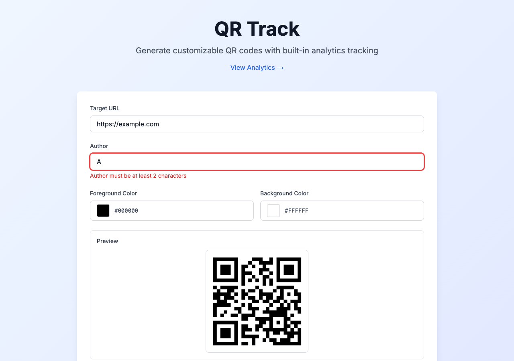

# Feature: Author Field for QR Code Creation

**ADW ID:** 189d1c96
**Date:** 2026-02-13
**Specification:** specs/issue-23-adw-189d1c96-sdlc_planner-add-author-field.md

## Overview

Added a mandatory author field to the QR code creation form to track who created each QR code. This enhancement improves organization and traceability when multiple people use the application by capturing the creator's name at the time of QR code generation.

## Screenshots

## What Was Built

- Database schema update with author field column
- Author input field in QR code creation form with validation
- Display of author information in analytics dashboard and individual QR code analytics
- Comprehensive validation for author input (client-side and server-side)
- Complete test coverage including unit tests and E2E test specification

## Technical Implementation

### Files Modified

- `db/migrations/004_add_author_field.sql`: Added author column to qr_codes table with default value 'Unknown' for existing records
- `src/types/database.ts`: Added author field to QRCode, QRCodeWithScans, and CreateQRCodeInput interfaces
- `src/lib/validations.ts`: Added author validation to generateQRCodeSchema with Zod (2-30 chars, alphanumeric + spaces)
- `src/lib/db.ts`: Updated createQRCode, getAllQRCodes, and getQRCodeAnalytics functions to handle author field
- `src/app/api/qr/generate/route.ts`: Updated API endpoint to accept and validate author field
- `src/app/api/analytics/[qrCodeId]/route.ts`: Ensured author field is returned in analytics data
- `src/components/qr-generator/QRGenerator.tsx`: Added author input field with real-time validation and error display
- `src/components/analytics/QRCodeList.tsx`: Added "Created by" author display on QR code cards
- `src/components/analytics/AnalyticsDashboard.tsx`: Added author display in individual analytics view
- `src/lib/__tests__/validations.test.ts`: Added comprehensive tests for author validation
- `src/components/qr-generator/__tests__/QRGenerator.test.tsx`: Updated component tests to include author field
- `src/app/api/qr/generate/__tests__/route.test.ts`: Updated API tests to validate author field handling
- `.claude/commands/e2e/test_author_field.md`: Created E2E test specification for author field functionality

### Key Changes

- **Database Migration**: Added author VARCHAR(30) NOT NULL column with default value 'Unknown' to maintain backward compatibility with existing QR codes
- **Validation Rules**: Author must be 2-30 characters, alphanumeric with spaces only, with automatic whitespace trimming
- **Client-Side Validation**: Real-time validation feedback with error messages displayed below the input field
- **Server-Side Validation**: Zod schema validation on API endpoint with transform to trim whitespace
- **UI Integration**: Author field integrated into the QR generator form between URL and color picker sections, with consistent styling and error states

## How to Use

1. Navigate to the QR code generator homepage
2. Enter a target URL in the URL field
3. Enter your name or identifier in the Author field (2-30 characters)
   - Only letters, numbers, and spaces are allowed
   - The field will show validation errors if input is invalid
4. Optionally customize QR code colors
5. Click "Generate QR Code" (button is disabled if author is invalid)
6. View your created QR code with author attribution
7. Check the Analytics Dashboard to see "Created by: [Author Name]" on QR code cards
8. Click on a QR code to view individual analytics with author information displayed

## Configuration

No additional configuration required. The author field is mandatory and validated automatically.

### Validation Rules
- **Minimum length**: 2 characters
- **Maximum length**: 30 characters
- **Allowed characters**: Letters (a-z, A-Z), numbers (0-9), and spaces
- **Not allowed**: Special characters, emoji, or punctuation

### Default Values
- Existing QR codes created before this feature show "Unknown" as the author

## Testing

### Unit Tests
Run `npm run test` to execute all unit tests, including:
- Author validation tests in `src/lib/__tests__/validations.test.ts`
- QRGenerator component tests in `src/components/qr-generator/__tests__/QRGenerator.test.tsx`
- API route tests in `src/app/api/qr/generate/__tests__/route.test.ts`

### E2E Testing
Execute the E2E test specification in `.claude/commands/e2e/test_author_field.md` to validate:
- Author field presence and labeling
- Validation error messages for invalid inputs
- Successful QR code generation with author
- Author display in analytics dashboard and individual analytics pages

### Type Checking
Run `npm run type-check` to verify TypeScript types are correct

### Build Validation
Run `npm run build` to ensure no build errors

## Notes

- The default value "Unknown" ensures backward compatibility with existing QR codes in the database
- Author field validation is intentionally simple (alphanumeric + spaces only) to avoid complexity with international characters in the initial implementation
- Future enhancement: Consider adding email validation option or linking to user accounts for authenticated users
- The author field is currently display-only and not filterable - this could be a future enhancement for better organization and search capabilities
- Whitespace is automatically trimmed from author input before validation and storage
- Author-only spaces input (e.g., "   ") fails validation after trimming
