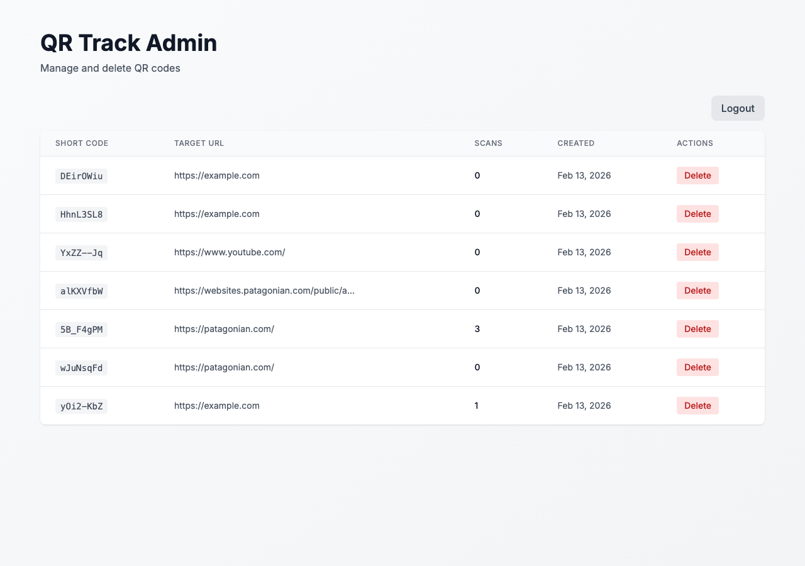
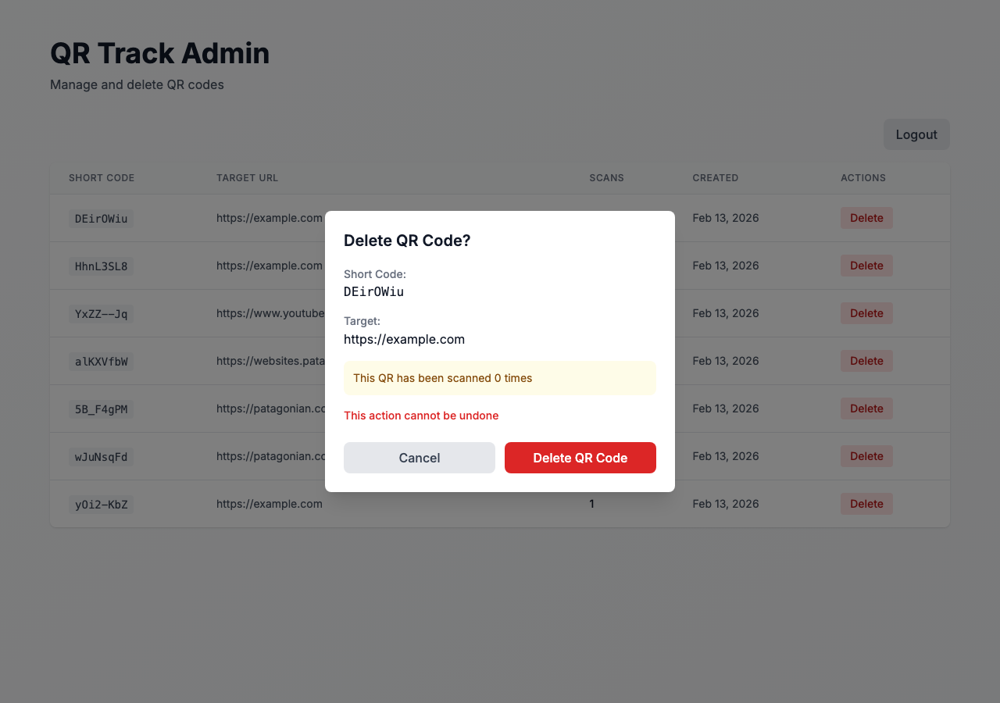
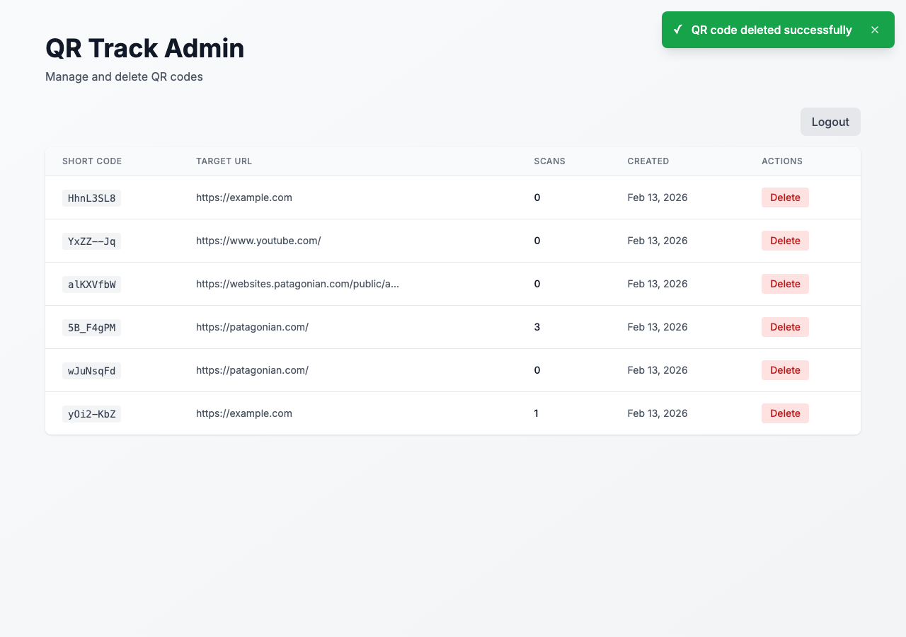

# Admin Panel - QR Management with Delete

**ADW ID:** 350ce5e4
**Date:** 2026-02-13
**Specification:** /Users/juanbaez/Documents/qr-track-challenge/specs/issue-19-adw-350ce5e4-sdlc_planner-admin-panel-qr-management.md

## Overview

A password-protected admin panel that enables authorized users to manage and delete QR codes from the system. The panel features session-based authentication, rate limiting for security, and soft delete functionality to preserve historical data while removing QR codes from public views.

## Screenshots

### Admin Login Page


The login page features a clean, centered form with the playful instruction "Enter your password here" - which is literally the password ("yourpasswordhere").

### Login Error


Failed login attempts display error messages with remaining attempt counts.

### Admin Dashboard


The admin dashboard displays all active QR codes in a table format with short codes, target URLs, scan counts, creation dates, and delete actions.

### Delete Confirmation Modal


A confirmation modal displays QR code details, scan count warning, and clear action buttons before deletion.

### Delete Success Toast


Toast notifications provide immediate feedback for successful deletions.

## What Was Built

- Password-protected admin authentication with Easter egg password ("yourpasswordhere")
- Session management with 1-hour expiration
- IP-based rate limiting (5 attempts per hour)
- Admin dashboard with QR code management table
- Soft delete functionality with database migration
- Delete confirmation modal with scan count warnings
- Toast notification system for user feedback
- Complete API endpoints for authentication and QR deletion
- E2E test specifications for admin panel functionality

## Technical Implementation

### Files Modified

**Database & Migrations:**
- `db/migrations/003_add_deleted_at_column.sql`: Added `deleted_at` timestamp column with index for soft delete functionality
- `src/types/database.ts`: Added `deleted_at: Date | null` to QRCode type
- `src/lib/db.ts`: Updated all queries to filter out soft-deleted records, added `softDeleteQRCode()` and `getQRCodeByShortCodeIncludeDeleted()` functions

**API Routes:**
- `src/app/api/admin/auth/route.ts`: POST endpoint for password authentication with rate limiting, DELETE endpoint for logout
- `src/app/api/admin/qr/[shortCode]/route.ts`: DELETE endpoint for soft deleting QR codes with session validation

**Validation:**
- `src/lib/validations.ts`: Added `adminAuthSchema` for password validation

**Session & Security:**
- `src/lib/admin-session.ts`: Session management utilities with httpOnly cookies, 1-hour expiration
- `src/lib/rate-limit.ts`: In-memory rate limiter tracking attempts by IP address with configurable limits

**Pages:**
- `src/app/admin/page.tsx`: Admin login page with authentication check
- `src/app/admin/dashboard/page.tsx`: Admin dashboard with QR list and logout functionality

**Components:**
- `src/components/admin/AdminLoginForm.tsx`: Login form with password input and error handling
- `src/components/admin/AdminQRList.tsx`: QR code table with delete functionality, optimistic UI updates
- `src/components/admin/DeleteConfirmationModal.tsx`: Confirmation dialog with QR details and scan count warning
- `src/components/admin/Toast.tsx`: Toast notification component with success/error variants

**Testing:**
- `.claude/commands/e2e/test_admin_panel.md`: E2E test specification for complete admin workflow
- `.claude/commands/e2e/test_city_name_decoding.md`: E2E test for URL-encoded city name handling
- `src/lib/__tests__/utils.test.ts`: Added test for `decodeIfEncoded` utility function

### Key Changes

1. **Soft Delete Pattern**: All QR code queries now include `WHERE deleted_at IS NULL` filter. Deleted QR codes remain in the database for historical analytics but are excluded from all public-facing queries and redirect handling.

2. **Rate Limiting**: In-memory rate limiter tracks failed authentication attempts by IP address. After 5 failed attempts within an hour, the IP is blocked until the time window expires. Successful login clears the attempt counter.

3. **Session Security**: Admin sessions use httpOnly, secure (in production), sameSite: 'lax' cookies that expire after 1 hour. All admin routes validate session before granting access.

4. **Optimistic UI Updates**: Delete actions immediately remove items from the UI, then rollback on failure with error toast notifications for better user experience.

5. **Database Performance**: Added index on `deleted_at` column (`idx_qr_codes_deleted_at`) to optimize queries filtering out deleted records.

## How to Use

### Accessing the Admin Panel

1. Navigate to `/admin`
2. Enter the password: `yourpasswordhere` (literal phrase)
3. Click "Access Admin Panel"

### Managing QR Codes

1. View all active QR codes in the table with:
   - Short code
   - Target URL
   - Total scan count
   - Creation date
   - Delete action button

2. To delete a QR code:
   - Click the red "Delete" button for the desired QR code
   - Review the confirmation modal showing:
     - Short code
     - Target URL
     - Scan count warning
   - Click "Delete QR Code" to confirm
   - The QR code is immediately removed from the list
   - A success toast appears confirming deletion

3. To log out:
   - Click the "Logout" button in the top-right corner
   - You'll be redirected back to the login page

### Session Management

- Sessions automatically expire after 1 hour of inactivity
- Logging out manually clears the session immediately
- Attempting to access `/admin/dashboard` without a valid session redirects to `/admin`

## Configuration

### Environment Variables

No additional environment variables required. The system uses:
- Static password: `yourpasswordhere` (hardcoded in `src/app/api/admin/auth/route.ts`)
- Rate limit: 5 attempts per hour (configurable in `src/lib/rate-limit.ts`)
- Session duration: 1 hour (configurable in `src/lib/admin-session.ts`)

### Rate Limiting Configuration

To modify rate limiting settings, edit `src/lib/rate-limit.ts`:
```typescript
const MAX_ATTEMPTS = 5 // Maximum attempts per window
const WINDOW_MS = 60 * 60 * 1000 // Time window (1 hour)
```

### Session Configuration

To modify session duration, edit `src/lib/admin-session.ts`:
```typescript
maxAge: 60 * 60 // Session duration in seconds (1 hour)
```

## Testing

### E2E Testing

Run the admin panel E2E tests:
```bash
# Read and execute the E2E test specification
# See .claude/commands/e2e/test_admin_panel.md
```

### Manual Testing

1. **Authentication:**
   - Test incorrect password shows error
   - Test rate limiting after 5 failed attempts
   - Test successful login redirects to dashboard
   - Test session persists across page refreshes

2. **QR Management:**
   - Verify all active QR codes display correctly
   - Test delete confirmation modal shows correct details
   - Test successful deletion removes QR from list
   - Test deleted QR returns 404 on redirect (`/r/[shortCode]`)

3. **Session Management:**
   - Test logout clears session
   - Test accessing dashboard without session redirects to login
   - Test session expires after 1 hour

### Database Migration

Apply the soft delete migration:
```bash
npm run db:migrate
```

## Notes

### Easter Egg Password

The password "yourpasswordhere" is intentional wordplay. The UI instructs users to "Enter your password here," making the literal phrase the password - a playful touch for an internal admin tool.

### Soft Delete Benefits

- **Data Preservation**: Scan analytics remain intact for historical reporting
- **Audit Trail**: Deleted QR codes can be reviewed if needed
- **Data Recovery**: Potential to "undelete" QR codes in future enhancements
- **Referential Integrity**: Foreign key relationships remain valid

### Security Considerations

1. **Rate Limiting**: In-memory rate limiter is suitable for single-instance deployments. For multi-instance production environments, consider Redis-based rate limiting.

2. **Static Password**: The hardcoded password is an interim solution. Future enhancements should implement full authentication with NextAuth.js and user-specific accounts.

3. **CSRF Protection**: Consider adding CSRF tokens for additional security in production environments.

4. **Session Cookies**: Using httpOnly prevents XSS access, secure flag ensures HTTPS-only in production, and sameSite: 'lax' balances security with usability.

### Future Enhancements

- Full authentication system (NextAuth.js)
- User ownership of QR codes
- Personal dashboards per user
- Role-based access control (RBAC)
- Admin activity logging for audit trails
- "Undelete" functionality to restore soft-deleted QR codes
- Redis-based rate limiting for distributed deployments
