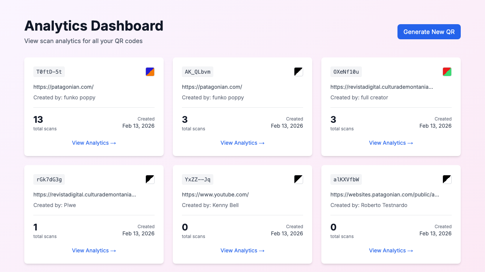
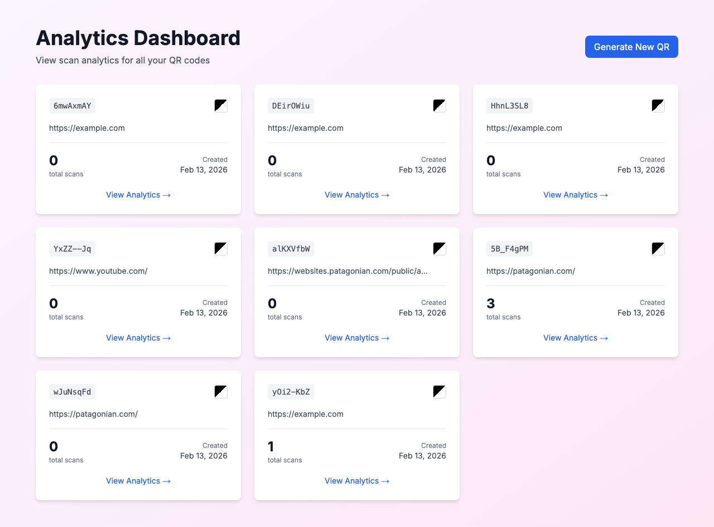
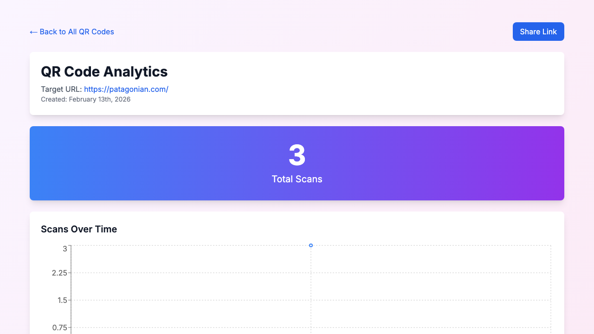

# Analytics Dashboard Scan Count Fix

**ADW ID:** 48538fc4
**Date:** 2026-02-13
**Specification:** specs/issue-13-adw-48538fc4-sdlc_planner-fix-dashboard-scan-count.md

## Overview

Fixed a critical bug where the Analytics Dashboard displayed incorrect scan counts (showing "0 total scans") while the individual analytics page showed the correct count. The issue was caused by PostgreSQL's BIGINT type handling in the node-postgres library, where COUNT() results were returned as strings and not properly converted to numbers.

## Screenshots

### Before: Dashboard showing 0 scans


### After: Dashboard showing correct scan count


### Individual analytics showing correct count


### Another QR code with correct count


## What Was Built

- Fixed SQL query in `getAllQRCodes()` function to properly cast BIGINT count to INTEGER
- Improved type conversion from PostgreSQL numeric types to JavaScript numbers
- Created E2E test suite to validate scan count consistency between dashboard and detail views

## Technical Implementation

### Files Modified

- `src/lib/db.ts`: Fixed the SQL query and result mapping in `getAllQRCodes()` function (lines 124 and 138)
- `.claude/commands/e2e/test_dashboard_scan_count.md`: Added new E2E test to validate scan count display accuracy

### Key Changes

1. **SQL Query Cast**: Changed `COALESCE(COUNT(s.id), 0) as total_scans` to `COALESCE(COUNT(s.id), 0)::INTEGER as total_scans` to ensure PostgreSQL returns an integer type instead of BIGINT
2. **Type Conversion**: Updated result mapping from `parseInt(row.total_scans)` to `Number(row.total_scans) || 0` for safer type conversion with fallback
3. **Root Cause**: PostgreSQL's `pg` library returns BIGINT values as strings to avoid JavaScript precision issues. By casting to INTEGER in SQL, we ensure consistent numeric handling for scan counts (which will never exceed JavaScript's safe integer limit)

## How to Use

The fix is transparent to users. The Analytics Dashboard at `/analytics` now correctly displays scan counts that match the individual analytics pages at `/analytics/[id]`.

To verify the fix:
1. Navigate to the Analytics Dashboard
2. Observe scan counts for each QR code
3. Click "View Analytics" on any QR code
4. Verify the individual page shows the same scan count as the dashboard

## Configuration

No configuration changes required. The fix is applied at the database query level.

## Testing

### E2E Test
A new E2E test was created at `.claude/commands/e2e/test_dashboard_scan_count.md` that:
1. Navigates to the Analytics Dashboard
2. Verifies QR codes display non-zero scan counts
3. Navigates to individual analytics pages
4. Validates scan counts match between dashboard and detail views
5. Takes screenshots to document the fix

### Running the Test
```bash
# Read the E2E test instructions
cat .claude/commands/test_e2e.md

# Execute the dashboard scan count test
cat .claude/commands/e2e/test_dashboard_scan_count.md
```

### Validation Commands
All validation passed:
- TypeScript type checking
- ESLint code quality checks
- Production build
- Unit tests

## Notes

- This bug affected production at https://qr-track-challenge.vercel.app/analytics where users were seeing misleading "0 scans" for QR codes that had actual scan activity
- The individual analytics endpoint was working correctly, making this a data inconsistency bug rather than a backend data issue
- PostgreSQL's BIGINT type is used for COUNT() to support arbitrarily large counts, but for QR scan counts, INTEGER is sufficient and avoids the string conversion complexity
- The same `parseInt()` pattern exists in `getQRCodeAnalytics()` function but worked correctly there, possibly due to different query structure. For consistency, consider applying the `::INTEGER` cast pattern across all COUNT() queries
