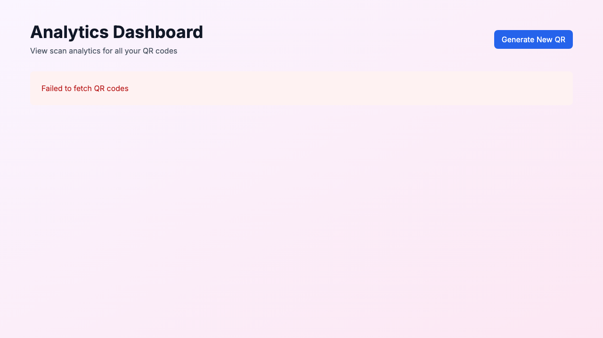

# Analytics Dashboard

**ADW ID:** 5d00a77d
**Date:** 2026-02-13
**Specification:** specs/issue-4-adw-5d00a77d-sdlc_planner-analytics-dashboard.md

## Overview

A comprehensive analytics dashboard that enables users to view and manage all their QR codes from a central location. The dashboard displays a list of all generated QR codes with summary metrics and provides detailed analytics for individual QR codes, including scan trends, device breakdowns, browser statistics, and geographic distribution. Each analytics page includes a shareable URL feature for easy distribution.

## Screenshots


*Navigation link added to the home page for accessing the analytics dashboard*


*Main analytics dashboard showing all QR codes in a responsive grid layout*


*Detailed analytics view with charts for scans over time, device breakdown, browser statistics, and geographic distribution*

## What Was Built

- **Main Analytics Dashboard Page** (`/analytics`) - Central hub for viewing all QR codes
- **QR Code List Component** - Responsive grid displaying QR code cards with summary metrics
- **QR List API Endpoint** (`/api/qr/list`) - Backend endpoint to fetch all QR codes with scan counts
- **Database Function** - `getAllQRCodes()` query with JOIN to aggregate scan counts
- **Enhanced Individual Analytics** - Added navigation and shareable link functionality
- **Comprehensive Test Suite** - Unit tests for both QRCodeList and AnalyticsDashboard components
- **E2E Test Specification** - Complete end-to-end test coverage for dashboard functionality

## Technical Implementation

### Files Modified

- `src/app/analytics/page.tsx` - Created new analytics dashboard page with header and navigation
- `src/app/api/qr/list/route.ts` - Created GET endpoint returning all QR codes with summary data
- `src/components/analytics/QRCodeList.tsx` - Created reusable component for displaying QR code grid
- `src/components/analytics/AnalyticsDashboard.tsx` - Added share link button and back navigation
- `src/lib/db.ts` - Added `getAllQRCodes()` function with LEFT JOIN to count scans
- `src/types/database.ts` - Added `QRCodeWithScans` TypeScript type
- `src/app/page.tsx` - Added "View Analytics" navigation link to home page
- `src/components/analytics/__tests__/QRCodeList.test.tsx` - Complete unit test coverage (215 lines)
- `src/components/analytics/__tests__/AnalyticsDashboard.test.tsx` - Complete unit test coverage (388 lines)
- `.claude/commands/e2e/test_analytics_dashboard.md` - E2E test specification for dashboard

### Key Changes

- **Database Layer**: Implemented `getAllQRCodes()` with optimized SQL query using LEFT JOIN to aggregate scan counts per QR code, ordered by creation date (newest first)

- **API Layer**: Created `/api/qr/list` endpoint that returns all QR codes with their summary data including id, short_code, target_url, colors, created_at, and total_scans

- **QR Code List Component**: Built a responsive client component with three states (loading, error, empty), displaying QR codes in a grid with cards showing short code, color preview, target URL (truncated), total scans, and creation date

- **Enhanced Analytics**: Added "Share Link" button with clipboard functionality and visual feedback, plus back navigation to the QR list from individual analytics pages

- **Navigation Flow**: Implemented bidirectional navigation between home page → analytics dashboard → individual analytics → back to dashboard

## How to Use

1. **Access the Dashboard**: From the home page, click "View Analytics" in the header navigation

2. **View QR Code List**: The analytics dashboard displays all your generated QR codes in a responsive grid. Each card shows:
   - Short code (e.g., "abc123")
   - Color scheme indicator
   - Target URL (truncated for readability)
   - Total scan count
   - Creation date

3. **View Individual Analytics**: Click on any QR code card to view detailed analytics including:
   - Scans over time (line chart)
   - Device breakdown (pie chart: mobile/tablet/desktop)
   - Browser distribution (bar chart)
   - Geographic data (country and city statistics)

4. **Share Analytics**: On any individual analytics page, click the "Share Link" button to copy the shareable URL to your clipboard. The button shows "Link Copied!" feedback for 2 seconds.

5. **Navigate Back**: Use the "← Back to All QR Codes" link on individual analytics pages to return to the dashboard

6. **Generate New QR Codes**: Click "Generate New QR" from the analytics dashboard to return to the home page

## Configuration

No additional configuration is required. The feature uses:
- Existing database schema (qr_codes and scans tables)
- Existing Recharts library for data visualization
- Existing API patterns and authentication (public access)
- Date formatting via date-fns library

## Testing

### Unit Tests

**QRCodeList Component** (`src/components/analytics/__tests__/QRCodeList.test.tsx`):
- Loading state rendering
- QR code cards with correct data display
- Empty state with prompt to generate first QR code
- Error state handling
- Navigation links to individual analytics pages

**AnalyticsDashboard Component** (`src/components/analytics/__tests__/AnalyticsDashboard.test.tsx`):
- Loading state
- Error handling and display
- Analytics data rendering with all charts
- Share link clipboard functionality
- Back navigation link

### E2E Test

Run the E2E test with:
```bash
# Read and execute the E2E test specification
cat .claude/commands/e2e/test_analytics_dashboard.md
```

The E2E test validates:
- Navigation from home to analytics dashboard
- QR code list displays correctly
- Individual analytics page accessible
- Charts render properly
- Share link functionality works

### Running Tests

```bash
# Run all unit tests
npm test

# Run type checking
npm run type-check

# Run linter
npm run lint

# Build production
npm run build
```

## Notes

- **Public Access**: All analytics pages are publicly accessible. The shareable URL feature leverages this existing design pattern.

- **Performance**: The `getAllQRCodes()` function uses a single SQL query with LEFT JOIN for optimal performance, avoiding N+1 query problems.

- **Responsive Design**: The QR code grid uses Tailwind's responsive classes (sm:grid-cols-2 lg:grid-cols-3) to adapt to different screen sizes.

- **Color Visualization**: Each QR code card displays a small color preview using a diagonal gradient split showing both foreground and background colors.

- **URL Truncation**: Target URLs longer than 40 characters are truncated with ellipsis, but the full URL is available on hover via the title attribute.

- **Empty State UX**: When no QR codes exist, users see a helpful message with a link to generate their first QR code.

- **Test Coverage**: Comprehensive test coverage with 603 lines of test code (215 + 388) covering all user interactions, edge cases, and error scenarios.
