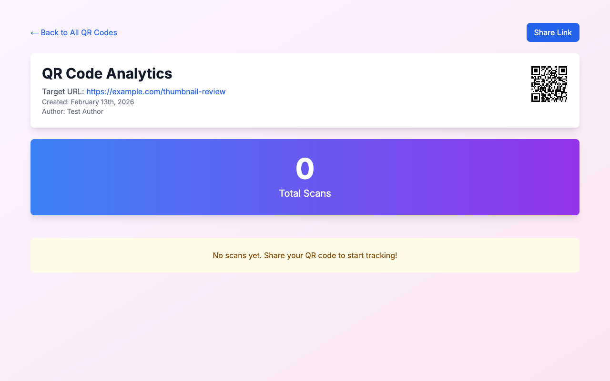
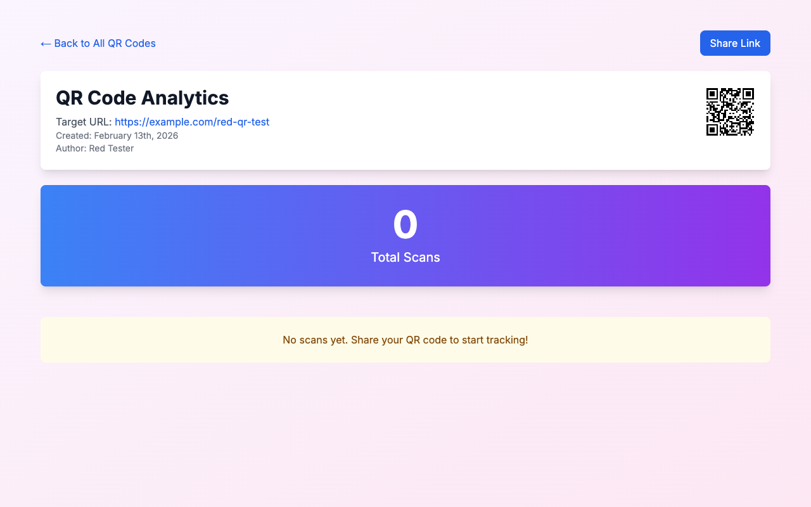

# QR Code Thumbnail with Download in Analytics

**ADW ID:** 64ca1d17
**Date:** 2026-02-13
**Specification:** specs/issue-25-adw-64ca1d17-sdlc_planner-add-qr-thumbnail-download.md

## Overview

Added a QR code thumbnail (80×80px) to the analytics page header that displays the QR code with its original colors and allows users to download it as a 256×256px PNG file by clicking on the thumbnail. This eliminates the need to navigate back to the home page to regenerate and download QR codes.

## Screenshots






## What Was Built

- **QR Thumbnail Display**: 80×80px QR code thumbnail positioned on the right side of the analytics header card
- **Color Preservation**: QR codes render with their original foreground and background colors from generation
- **Interactive Hover State**: Semi-transparent overlay with download icon appears on hover
- **Click-to-Download**: Clicking the thumbnail downloads a 256×256px PNG file named `qr-code-{shortCode}.png`
- **Accessibility**: Keyboard navigation support (Enter/Space to download) and proper ARIA labels
- **E2E Test Specification**: Comprehensive test documentation for validating the feature

## Technical Implementation

### Files Modified

- `src/components/analytics/AnalyticsDashboard.tsx`: Added QR thumbnail rendering, hover state management, and download functionality using the `qrcode` library
- `src/app/api/analytics/[qrCodeId]/route.ts`: Added `fg_color` and `bg_color` to the API response payload
- `src/components/analytics/__tests__/AnalyticsDashboard.test.tsx`: Added unit tests for QR thumbnail rendering and download functionality
- `.claude/commands/e2e/test_qr_thumbnail_download.md`: Created E2E test specification with manual test steps

### Key Changes

- **Client-Side QR Generation**: Used the existing `qrcode` library to generate QR codes on-demand at two sizes (80px for display, 256px for download)
- **State Management**: Added `qrHovered` state for hover overlay and `qrThumbnailUrl` state for the generated thumbnail data URL
- **Download Handler**: Implemented `handleDownloadQR` callback that generates a 256×256px QR code using Canvas API and triggers browser download
- **Layout Update**: Modified header card to use flexbox (`flex justify-between`) to position the QR thumbnail on the right without breaking responsive design
- **Accessibility Enhancements**: Added keyboard event handlers (Enter/Space), role="button", tabIndex, and aria-label for screen reader support

## How to Use

1. **Navigate to Analytics**: Click "View Analytics" for any QR code from the home page
2. **View QR Thumbnail**: The QR code thumbnail (80×80px) appears on the right side of the "QR Code Analytics" header card
3. **Hover to Preview Download**: Hover over the thumbnail to see the semi-transparent overlay with download icon
4. **Click to Download**: Click the thumbnail (or press Enter/Space when focused) to download the QR code as a PNG file
5. **File Naming**: The downloaded file will be named `qr-code-{shortCode}.png` (e.g., `qr-code-abc123.png`)

## Configuration

No configuration required. The feature uses:
- **Colors**: Automatically uses the QR code's original `fg_color` and `bg_color` from the database
- **Default Colors**: Falls back to black foreground (#000000) and white background (#FFFFFF) if colors are missing
- **Download Size**: Fixed at 256×256px (consistent with the generation preview size)
- **Display Size**: Fixed at 80×80px for the thumbnail

## Testing

### Unit Tests

Run the test suite to verify:
```bash
pnpm test
```

Tests cover:
- QR thumbnail rendering with correct dimensions
- Color preservation from API response
- Download functionality trigger on click
- Filename generation with correct pattern

### E2E Testing

Follow the E2E test specification:
```bash
# Read and execute the E2E test steps
cat .claude/commands/e2e/test_qr_thumbnail_download.md
```

Tests validate:
- Thumbnail visibility and positioning
- Hover overlay appearance
- Download trigger and file naming
- Cross-browser compatibility
- Accessibility features

### Type Safety

Verify TypeScript compilation:
```bash
pnpm tsc --noEmit
```

### Production Build

Ensure build succeeds:
```bash
pnpm build
```

## Notes

- **Library Reuse**: Uses the existing `qrcode` library (already installed) instead of `qrcode.react` for better control over PNG generation
- **Performance**: QR thumbnail is generated once on component mount; download QR is generated on-demand when clicked
- **Canvas API**: Download functionality uses Canvas API's `toDataURL()` method, which is well-supported across all major browsers
- **No Storage Overhead**: QR codes are generated client-side, no additional database storage or server processing required
- **Responsive Design**: Layout uses flexbox with proper spacing; thumbnail scales appropriately on smaller screens
- **Image Optimization**: Used Next.js `Image` component with `unoptimized` flag since the QR is a data URL (already optimized)
