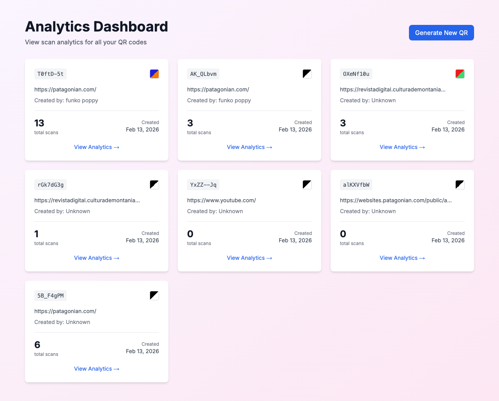
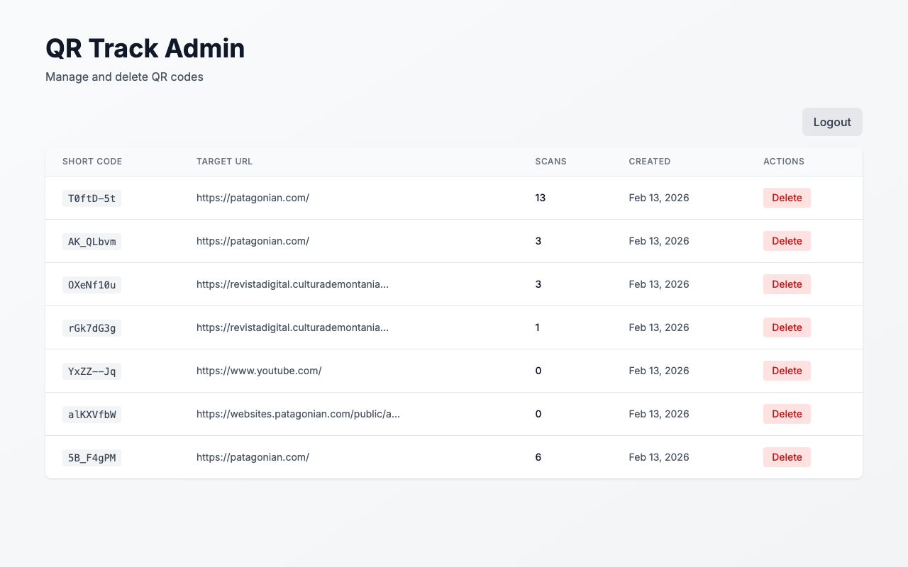
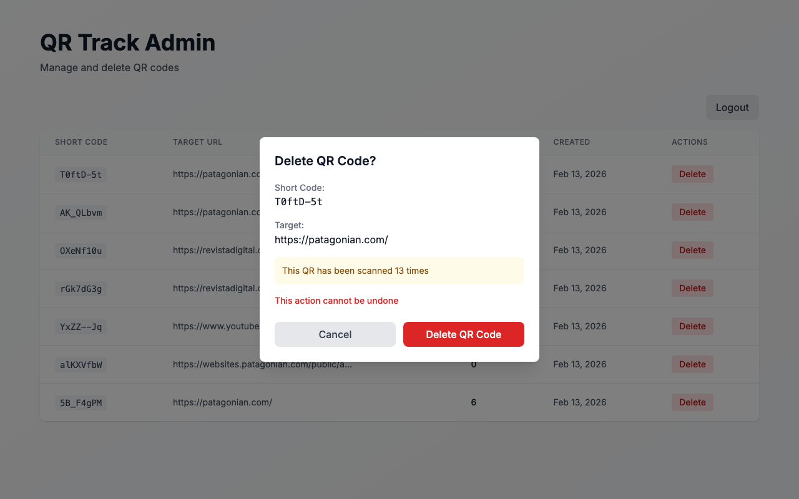
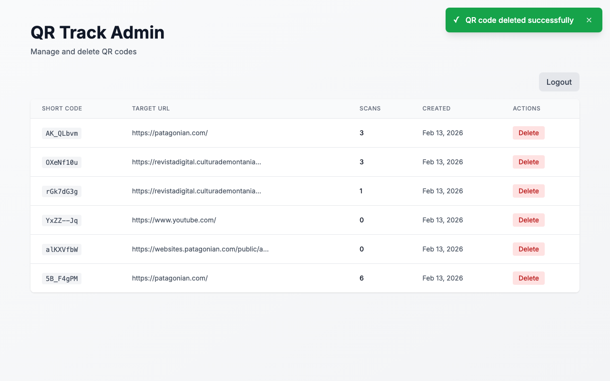
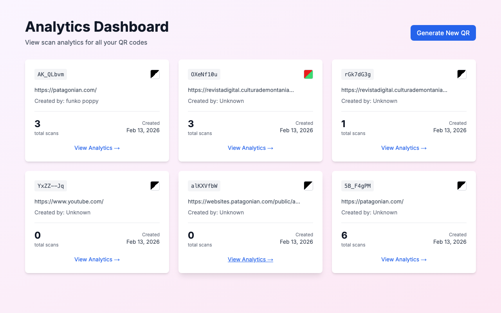
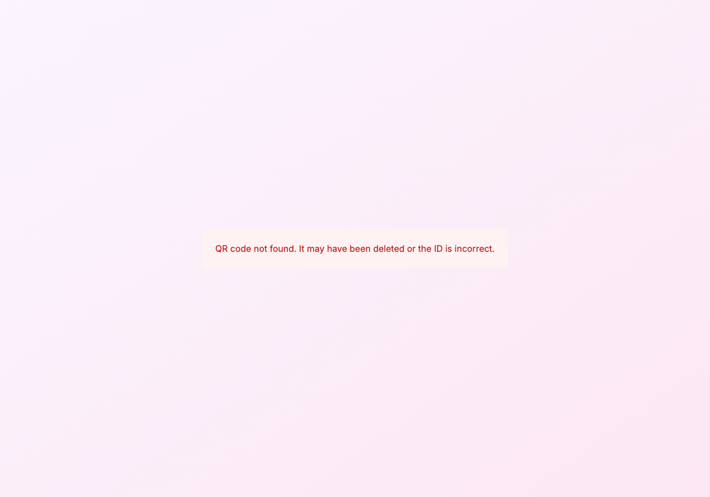

# Deleted QR Code Filtering in Analytics

**ADW ID:** a8e0635d
**Date:** 2026-02-13
**Specification:** specs/issue-27-adw-a8e0635d-sdlc_planner-filter-deleted-qr-analytics.md

## Overview

This feature ensures that soft-deleted QR codes (those with a `deleted_at` timestamp) are properly filtered out from the analytics dashboard. When QR codes are deleted via the Admin Panel, they should no longer appear in the analytics list view, and direct access to their analytics should return a 404 error. The implementation verifies existing database-level filtering is working correctly and adds comprehensive test coverage to prevent regressions.

## Screenshots

### Before Deletion - Analytics Dashboard


### Admin Panel - Delete Action




### After Deletion - Analytics Dashboard


### Direct Access to Deleted QR Code


## What Was Built

- **Unit Tests**: Added test coverage in `QRCodeList.test.tsx` to verify the component correctly displays only non-deleted QR codes returned by the API
- **E2E Test Definition**: Created comprehensive E2E test documentation for validating the complete delete-to-analytics workflow
- **Verification**: Confirmed existing database-level filtering (`WHERE deleted_at IS NULL`) is functioning correctly

## Technical Implementation

### Files Modified

- `src/components/analytics/__tests__/QRCodeList.test.tsx`: Added 64 lines of test coverage for deleted QR code filtering behavior
- `.claude/commands/e2e/test_deleted_qr_analytics.md`: Created new E2E test definition (77 lines) to validate the full deletion workflow

### Key Changes

- **Server-Side Filtering (Already Implemented)**: The `getAllQRCodes()` function in `src/lib/db.ts:129` includes `WHERE qr.deleted_at IS NULL`, ensuring deleted QR codes are filtered at the database level
- **API Response Filtering**: The `getQRCodeById()` function in `src/lib/db.ts:59` includes `AND deleted_at IS NULL`, returning 404 for deleted QR codes when accessed directly
- **Unit Test Coverage**: Added two test cases:
  - Verifies only non-deleted QR codes (returned by API) are displayed in the list
  - Verifies empty state is shown when all QR codes have been deleted
- **E2E Test Documentation**: Created comprehensive workflow test covering deletion in admin panel, verification in analytics list, and 404 response for direct access

## How to Use

The filtering is automatic and transparent to users:

1. **Admin Panel Deletion**: When an admin deletes a QR code in `/admin`, it is soft-deleted (sets `deleted_at` timestamp)
2. **Analytics View**: Navigate to `/analytics` - deleted QR codes will not appear in the list
3. **Direct Access Protection**: Attempting to access a deleted QR code's analytics via `/analytics/[id]` returns a 404 error page

## Configuration

No configuration required. The filtering is built into the database queries and applies automatically to all analytics endpoints.

## Testing

### Unit Tests
Run the test suite to verify deleted QR code filtering:
```bash
npm test
```

The new tests in `QRCodeList.test.tsx` verify:
- Only active (non-deleted) QR codes are displayed
- Empty state is shown when no active QR codes exist

### E2E Testing
Execute the E2E test to validate the complete workflow:
```bash
# Follow instructions in .claude/commands/test_e2e.md
# Then run the specific test: .claude/commands/e2e/test_deleted_qr_analytics.md
```

The E2E test validates:
1. QR codes appear in analytics before deletion
2. Admin panel allows deletion of QR codes
3. Deleted QR codes disappear from analytics list
4. Direct access to deleted QR code analytics returns 404

## Notes

1. **Existing Implementation**: The core filtering logic was already implemented in `src/lib/db.ts` as part of the Admin Panel feature (commit `0dfa1f7`). This work primarily adds test coverage and verification.

2. **Soft Delete Pattern**: The application uses soft deletes (setting `deleted_at` timestamp) rather than hard deletes, allowing for potential recovery and maintaining data integrity with foreign key relationships.

3. **Database-Level Filtering**: Filtering occurs at the database query level, ensuring consistency across all API endpoints that fetch QR code data.

4. **No Client-Side Filtering**: The component does not perform filtering logic; it simply displays what the API returns. This ensures a single source of truth and prevents inconsistencies.

5. **Regression Prevention**: The added test coverage ensures future changes cannot inadvertently break the deleted QR code filtering behavior.
